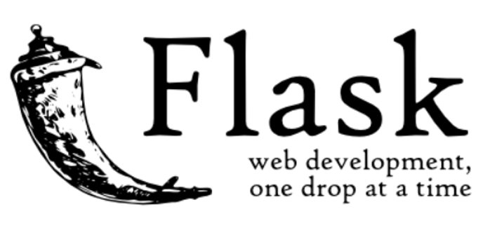
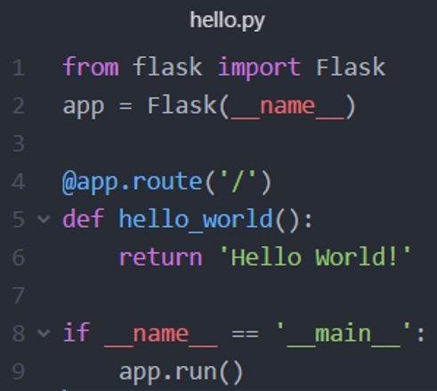

# Introduction to Web Development

A Web framework is a collection of packages or modules which allow developers to write Web applications or services without having to handle such low-level details as protocols, sockets or process/thread management.

## Python Web Development Frameworks

**Django** is a high-level Python Web framework that encourages rapid development and clean, pragmatic design. Python web development with Django is best suited for developing database driven web applications with attractive features like automatic admin interface and a templating system. For web development projects that don’t require extensive features, Django may be an overkill because of its confusing file system and strict directory structure.

https://www.djangoproject.com/

**Flask** is a micro web framework written in Python and based on the Werkzeug toolkit and Jinja2 template engine. Flask is considered more Pythonic than Django because Flask web application code is in most cases more explicit. 

Flask is easy to get started because there is little boilerplate code for getting a simple app up and running. Flask relies on third-party packages to do some of the less common web framework tasks. Flask is perfect for microservices and RESTful APIs.

http://flask.pocoo.org/

**Dash** is a Python framework for building analytical web applications and interfaces in Python. Built on top of Plotly.js, React, and Flask, Dash ties modern UI elements like dropdowns, sliders, and graphs to your analytical Python code.

https://plot.ly/products/dash/   

https://plot.ly/dash/gallery

**Bottle** is a fast and simple micro-framework for small web-applications. It offers request dispatching (Routes) with url parameter support, Templates, key/value Databases, a build-in HTTP Server and adapters for many third party WSGI/HTTP-server and template engines. All in a single file and with no dependencies other than the Python Standard Library.

https://bottlepy.org/docs/dev/

## Web Application Architectures

A simple web application requires   a Client  and a Server model    
*	Client-side
*	Server-side

A Data-Driven Web application requires   

*	Client-side
*	Server-side
*	Database

Greg Heileman, Web Application Architectures - University of New Mexico – Coursera   

Client makes request through HTTP network, Server then processes this request and figures out the right response to return to the Browser.

There are three essential layers in a web application:

* Front-End Layer This is the closest layer to the end users, and requires a lot of design and creativity. This layer is where technologies such as HTML ,CSS, and Javascript create the look and feel of our application. 

* Application Layer This is the middle layer where business and presentation logic work together to deliver the response back to the users. Web Frameworks like Flask enable to leverage Routes and Templates.

* Database Storage Layer (Orange): This layer is where data is stored and is what enables a data rich application.

Jeff Knupp wrote a very good explanation of how web "works"

https://jeffknupp.com/blog/2014/03/03/what-is-a-web-framework/

### HTTP and Response Codes

HTTP knows different methods for accessing URLs. The HTTP method tells the server what the clients wants to do with the requested page. There are nine 'verbs'

GET, HEAD, POST, PUT, DELETE, TRACE, OPTIONS, CONNECT, PATCH

GET (safe method) 

POST (used for modifying)

Status Codes are sent back from the server to the client, e.g. 200, 301, 404

200 : Successful GET

301 : Successful POST

404 : File not found

Routes are, essentially, URL patterns associated with different pages. So when someone enters a URL, behind the scenes, the application tries to match that URL to one of these predefined routes. In Flask, Routes are enabled by decorators.The route decorators notify the framework about the existence of specific URLs and the function meant to handle them. 

Flask leverages Jinja2 as template engine http://jinja.pocoo.org/docs/2.10/templates/

The Web Server Gateway Interface (WSGI) is a specification for simple and universal interface between web servers and web applications or frameworksfor the Python programming language.

## Model-View-Controller

**Model-View-Controller (MVC)** is a design pattern used to separate your application's concerns in order to make it easier to scale:

https://selftaughtcoders.com/model-view-controller-mvc-web-application/

 The MVC request process is as follows:
1.	A user requests to view a page by entering a URL.
2.	The application matches the URL to a predefined route.
3.	The controller action associated with the route is called.
4.	The controller action uses the models to retrieve all of the necessary data from a database, places the data in an array, and loads a view, passing along the data structure.
5.	The view accesses the structure of data and uses it to render the requested page, which is then presented to the user in their browser.

### Web App Database

Depending on the scale, different databases might be more suitable for handling different traffics.

SQL   vs NoSQL

SQLite MySQL PostgreSQL     vs   MongoDB

One of the simplest database is SQLite, where data is persisted in a single local file.
MySQL or PostgreSQL suit for production environments.

CRUD operations are stands for (Create/Read/Update/Delete)

### ORM and SQLAlchemy 

An object-relational mapper (ORM) is a code library that automates the transfer of data stored in relational databases tables into objects that are more commonly used in application code. It allow developers to access data from a backend by writing Python code instead of SQL queries. 

SQLAlchemy is the most popular ORMs. 

There are four components in writing SQLAlchemy code:

* A configuration component which we use to import all necessary modules

* A class object that defines how a database record maps to a normal Python object.

* A Table that represents a table in a database.

* A mapper that maps a Python class to a table in a database.

https://www.sqlalchemy.org/

Twitter Bootstrap: A front-end toolkit for rapidly developing web applications. It is a collection of CSS and HTML conventions. It uses some of the latest browser techniques to provide you with stylish typography, forms, buttons, tables, grids, navigation and everything else you need in a super tiny resource.”

## Practice:

http://flask.pocoo.org/docs/0.12/quickstart/#quickstart

http://flask.pocoo.org/docs/0.12/tutorial/

http://first-news-app.readthedocs.io/en/latest/
